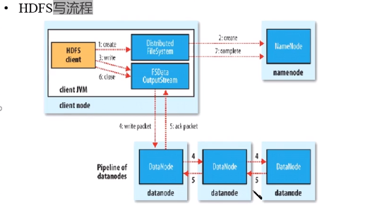

[TOC]

# HDFS

## 1 架构模型

- 文件元数据MetaData, 文件数据
    1. 元数据
    2. 文件数据

- （主）NameNode结点保存文件元数据：单节点
- （从）DataNode结点保存文件Block数据：多结点
- DataNode与NameNode保持**心跳** ，DataNode提交Block列表给NameNode
- HdfsClient与NameNode交互元数据信息
- HdfsClient与DataNode交互文件Block数据

## 2 NameNode

- **基于内存存储**：不会和磁盘发生交换
    1. 只存在内存中
    2. 持久化
- NameNode主要功能
    1. 接收客户端的读写服务
    2. 收集DataNode汇报的Block列表信息
- NameNode保存的metadata信息包括
    1. 文件owership和permissions
    2. 文件大小，时间
    3. Block列表：Block偏移量，位置信息
    4. Block每副本位置（由DataNode上报）

## 3 DataNode

- 本次磁盘目录存储数据（Block)，文件形式
- 同时存储Block的元数据信息文件
- 启动DataNode会想NameNode汇报block信息
- 通过namenode发送心跳保持联系（3秒1次），如果namenade10分钟没有收到dataname的心跳，则认为其已经lost,并copy其上的block到其他的datanode

## 4 HDFS优点

- 高容错性
    1. 数据自动保存多个副本
    2. 副本丢失后，自动回复
- 适合批处理
    1. 移动计算而非数据
    2. 数据位置暴露给计算机框架
- 适合大数据处理
- 可构建在廉价机器上

## 5 HDFS缺点

- 高延迟数据访问
- 小文件存取
    1. 占用NameNode大量内存
    2. 寻道时间超过读取时间
- 无法并发写入，无法随机修改（更新）

## 6 SecondaryNameNode（SNN）

- 它不是namenode的备份（但是可以做备份），它的主要工作是帮助namenode合并edits log,减少namenode启动时间
- SNN执行合并的时间
    1. 根据配置文件设置时间间隔默认为3600秒
    2. 根据配置文件edits log大小规定edits文件的最大值默认为64M

## 7 Block的副本的放置策略

## 8 HDFS写流程-重要

