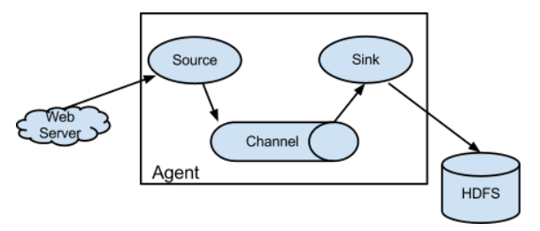

[TOC]

# 1 Flume基础

## 1 定义

Flume是一个高可用的、高可靠的、分布式的海量日志采集、聚合和传输的系统，Flume基于流式架构。

flume最主要的作用就是**实时**的读取本地磁盘数据，将数据写入到HDFS。

## 2 特点

flume的数据流由事件(Event)贯穿始终。事件是Flume的基本数据单位，它携带日志数据(字节数组形式)并且携带有头信息，这些Event由Agent外部的Source生成，当Source捕获事件后会进行特定的格式化，然后Source会把事件推入(单个或多个)Channel中。你可以把Channel看作是一个缓冲区，它将保存事件直到Sink处理完该事件。Sink负责持久化日志或者把事件推向另一个Source。

- flume的可靠性
    当节点出现故障时，日志能够被传送到其他节点上而不会丢失。Flume提供了三种级别的可靠性保障，从强到弱依次分别为：end-to-end（收到数据agent首先将event写到磁盘上，当数据传送成功后，再删除；如果数据发送失败，可以重新发送。），Store on failure（这也是scribe采用的策略，当数据接收方crash时，将数据写到本地，待恢复后，继续发送），Besteffort（数据发送到接收方后，不会进行确认）。
- flume的可恢复性
    还是靠Channel。推荐使用FileChannel，事件持久化在本地文件系统里(性能较差)。

# 2 flume基础架构

## 2.1 Agent

flume的运行单元，里面必须包含一个或者多个source、channel、sink，运行在单个jvm中。

## 2.2 Source

Source是数据的收集端，负责将数据捕获后进行特殊的格式化，将数据封装到事件（event） 里，然后将事件推入Channel中。

Flume提供了各种source的实现，包括Avro Source、Exce Source、Spooling Directory Source、NetCat Source、Syslog Source、Syslog TCP Source、Syslog UDP Source、HTTP Source、HDFS Source，etc。如果内置的Source无法满足需要， Flume还支持自定义Source。

## 2.3 Channel

Channel是连接Source和Sink的组件，大家可以将它看做一个数据的缓冲区（数据队列），它可以将事件暂存到内存中也可以持久化到本地磁盘上， 直到Sink处理完该事件。

Flume对于Channel，则提供了Memory Channel、JDBC Chanel、File Channel，etc。

　　MemoryChannel可以实现高速的吞吐，但是无法保证数据的完整性。

　　MemoryRecoverChannel在官方文档的建议上已经建义使用FileChannel来替换。

　　FileChannel保证数据的完整性与一致性。在具体配置不现的FileChannel时，建议FileChannel设置的目录和程序日志文件保存的目录设成不同的磁盘，以便提高效率。

## 2.4 Sink

Flume Sink取出Channel中的数据，进行相应的存储文件系统，数据库，或者提交到远程服务器。

Flume也提供了各种sink的实现，包括HDFS sink、Logger sink、Avro sink、File Roll sink、Null sink、HBase sink，etc。

Flume Sink在设置存储数据时，可以向文件系统中，数据库中，hadoop中储数据，在日志数据较少时，可以将数据存储在文件系中，并且设定一定的时间间隔保存数据。在日志数据较多时，可以将相应的日志数据存储到Hadoop中，便于日后进行相应的数据分析。

## 2.5 Event

事件，是数据的描述。

## 2.6 Interceptor

拦截器，作用于source阶段，用于过滤数据。

## 2.7 Selectorer

 选择器，作用于source阶段，默认是replicating，也就是复用功能。mutiplxing

## 2.8 Groupsinks

sink组，用于将多个sink选择sink。