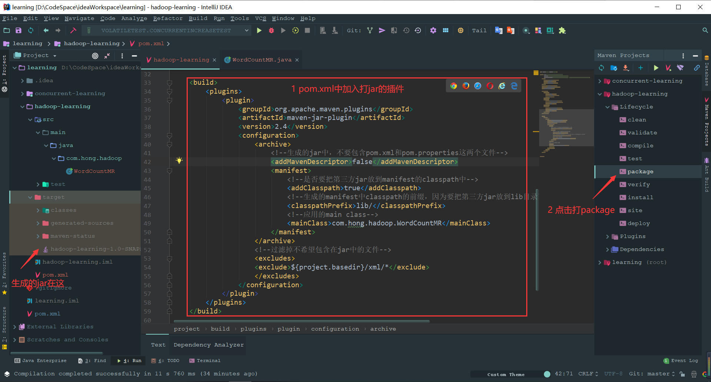
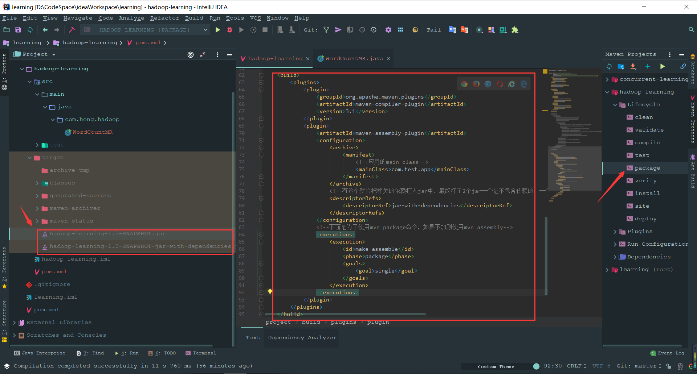

[TOC]

# Maven学习笔记

Maven是基于java的一个依赖控制工具，所以在使用Maven之前需要安装Java。

## 0 setting.xml

配置镜像，配置仓库地址在对应的settings.xml中（默认在c:/用户/用户名/.m2中，如：C:\Users\hong\ .m2）

```xml
<?xml version="1.0" encoding="UTF-8"?>

<settings xmlns="http://maven.apache.org/SETTINGS/1.0.0"
          xmlns:xsi="http://www.w3.org/2001/XMLSchema-instance"
          xsi:schemaLocation="http://maven.apache.org/SETTINGS/1.0.0 http://maven.apache.org/xsd/settings-1.0.0.xsd">
	
  <-- 最终jar下载的位置 -->
  <localRepository>D:/CodeSpace/maven/mavenRepository</localRepository>
  <pluginGroups>
  </pluginGroups>

  <proxies>
  </proxies>

  <servers>
  </servers>
	
  <-- 设置镜像为阿里云 -->
  <mirrors>
      <mirror>
            <id>alimaven</id>
            <mirrorOf>central</mirrorOf>
            <name>aliyun maven</name>
            <url>http://maven.aliyun.com/nexus/content/groups/public/</url>
      </mirror>
  </mirrors>

  <profiles>
  </profiles>

</settings>
```

## 1 命令

### 1.1 基础命令

| 指令                | 说明                                                         |
| ------------------- | ------------------------------------------------------------ |
| mvn -v              | 查看Maven的信息（Maven版本，Maven home，Java version等）。   |
| mvn package         | 构建本项目。                                                 |
| mvn clean           | 删除target文件夹下编译产生的.class文件，作用是清理上一次构建生成的文件。 |
| mvn compile         | 编译整个工程，生成的.class文件存放到target目录下。           |
| mvn install         | 把自己打好的包，放入本地仓库，共别人使用。                   |
| mvn test            | 测试。                                                       |
| mvn dependency:tree | 显示依赖树                                                   |
| mvn dependency:list | 显示依赖列表                                                 |

### 1.2 长命令

```shell
// 创建一个名称为MyProject的项目，maven的groupId为proGroupID的项目模板（java项目）
// -DgroupId : 项目的groupId
// -DartifactId : 项目的artifactId
// -DarchetypeArtifactId : 一个maven快速构建的ArtifactId
// -DinteractiveMode : 设置是否使用询问模式
mvn archetype:generate -DgroupId="proGroupID" -DartifactId="MyProject" -DarchetypeArtifactId="maven-archetype-quickstart" -DinteractiveMode=false

    
// 利用mvn手动导入一些jar包（比如导入测javax.transaction:jta:jar:1.0.1B,jta.jar）
mvn install:install-file -DgroupId=javax.transaction -DartifactId=jta -Dversion=1.0.1B -Dpackaging=jar -Dfile=C:/jta.jar
```

## 2 依赖冲突&解决

假设有这种情况，A依赖B，B又依赖了C1，并且D依赖了C2（注：C1、C2是一个jar包只是版本不同），如果我们有个新项目E需要引入A又需要引入D，那么此时C1、C2就会依赖冲突。

通过exclusion可以消除依赖冲突。

在写pom的时候，我们写的一个依赖往往会依赖于其他的包，而这些包可能是过时的不安全的，因此需要排除并重新引用安全的版本，先在依赖这个项目的pom中去除想排除的依赖，再添加指定版本的依赖。

pom的依赖关系可以在idea查看，打开pom.xml。右键点击Diagram，即可显示完整的依赖关系图，包括pom没有明文写出的依赖。可以根据它来判断依赖是否有被重复引用，同时还能查看依赖的版本，十分方便

```xml
<dependency>  
    <groupId>org.apache.struts</groupId>  
    <artifactId>struts2-core</artifactId>  
    <version>${struts.version}</version>  
    <!-- 从struts2-core中排除asm -->
    <exclusions>  
            <groupId>asm</groupId>  
            <artifactId>asm</artifactId>  
    </exclusions>  
</dependency> 
```

## 3 dependencyManagement作用说明

在Maven多模块的时候，管理依赖关系是非常重要的，各种依赖包冲突，查询问题起来非常复杂，于是就用到了<dependencyManagement>

**示例说明，**

在父模块中：

```xml
<dependencyManagement>
        <dependencies>
            <dependency>
                <groupId>mysql</groupId>
                <artifactId>mysql-connector-java</artifactId>
                <version>5.1.44</version>
            </dependency>
           
        </dependencies>
</dependencyManagement>
```

那么在子模块中只需要<groupId>和<artifactId>即可，如：

```xml
<dependencies>
        <dependency>
            <groupId>mysql</groupId>
            <artifactId>mysql-connector-java</artifactId>
        </dependency>
 </dependencies>
```

说明

dependencyManagement可以统一管理项目的版本号，确保应用的各个项目的依赖和版本一致，不用每个模块项目都弄一个版本号，不利于管理，当需要变更版本号的时候只需要在父类容器里更新，不需要任何一个子项目的修改；**如果某个子项目需要另外一个特殊的版本号时，只需要在自己的模块dependencies中声明一个版本号即可**。子类就会使用子类声明的版本号，不继承于父类版本号。

**与dependencies区别：**

1. Dependencies相对于dependencyManagement，所有生命在dependencies里的依赖都会自动引入，并默认被所有的子项目继承。
2. dependencyManagement里只是声明依赖，**并不自动实现引入**，因此子项目需要显示的声明需要用的依赖。如果不在子项目中声明依赖，是不会从父项目中继承下来的；只有在子项目中写了该依赖项，并且没有指定具体版本，才会从父项目中继承该项，并且version和scope都读取自父pom;**另外如果子项目中指定了版本号，那么会使用子项目中指定的jar版本**。

## 4 Maven打jar包

### 4.1 打无依赖的包（相关的依赖不打入jar中，只对项目打jar）

在pom.xml中加入下面的：

```
    <build>
        <plugins>
            <plugin>
                <groupId>org.apache.maven.plugins</groupId>
                <artifactId>maven-jar-plugin</artifactId>
                <version>2.4</version>
                <configuration>
                    <archive>
                        <!--生成的jar中，不要包含pom.xml和pom.properties这两个文件-->
                        <addMavenDescriptor>false</addMavenDescriptor>
                        <manifest>
                            <!--是否要把第三方jar放到manifest的classpath中-->
                            <addClasspath>true</addClasspath>
                            <!--生成的manifest中classpath的前缀，因为要把第三方jar放到lib目录下，所以classpath的前缀是lib/-->
                            <classpathPrefix>lib/</classpathPrefix>
                            <!--应用的main class-->
                            <mainClass>com.hong.hadoop.WordCountMR</mainClass>
                        </manifest>
                    </archive>
                    <!--过滤掉不希望包含在jar中的文件-->
                    <excludes>
                    <exclude>${project.basedir}/xml/*</exclude>
                    </excludes>
                </configuration>
            </plugin>
        </plugins>
    </build>
```



### 4.2 打依赖的包（相关的依赖打入jar中）

在pom.xml中加入下面的：

```
    <build>
        <plugins>
            <plugin>
                <groupId>org.apache.maven.plugins</groupId>
                <artifactId>maven-compiler-plugin</artifactId>
                <version>3.1</version>
            </plugin>
            <plugin>
                <artifactId>maven-assembly-plugin</artifactId>
                <configuration>
                    <archive>
                        <manifest>
                            <!--应用的main class-->
                            <mainClass>com.test.app</mainClass>
                        </manifest>
                    </archive>
                    <!--有这个就会把相关的依赖打入jar中，最终打了2个jar一个是不包含依赖的，一个是包含依赖的-->
                    <descriptorRefs>
                        <descriptorRef>jar-with-dependencies</descriptorRef>
                    </descriptorRefs>
                </configuration>
                <!--下面是为了使用mvn package命令，如果不加则使用mvn assembly-->
                <executions>
                    <execution>
                        <id>make-assemble</id>
                        <phase>package</phase>
                        <goals>
                            <goal>single</goal>
                        </goals>
                    </execution>
                </executions>
            </plugin>
        </plugins>
    </build>
```

